## Introduction

### High Level Motivation
Facial Emotion Recognition (FER) is a growing field that plays a critical part in understanding human emotions and reactions. Among the different modalities, video offers the unique edge of capturing more subtle and nuanced insights into interpreting underlying emotions that may not be conveyed through speech, text, or image. This provides an useful tool for applications in user research, evaluation of client satisfaction, and even mental health monitoring services. 

### Problem Definition
Although useful, analyzing sentiment from video sources can be a challenging task due to the continuous nature of videos. During a video stream, the person's emotion may go through changes, which makes it difficult to assign one single sentiment classification. Thus, our goal for this project is to develop a tool that produces real-time dynamic sentiment analysis on video streams. 

### Input and Ouput
We envision the input for this tool being one of two possible formats: live webcam stream, or pre-recorded videos. Depending on the type of input video, the output format varies slightly. For a live webcam video stream input, the output will be a reconstructed version of the webcam stream with frame-by-frame emotion labels (which appears near the detected face). For a pre-recorded video stream input, the output would be the original video, with predicted emotion labels directly added to each frame. The two gifs below shows an example of input and output data for the tool we hope to develop.

<table width="100%">
  <tr>
    <th width="40%" style="text-align: center">Video Input</th>
    <th width="60%" style="text-align: center">Video Output with Prediction Labels</th>
  </tr>
  <tr>
    <td width="40%" style="text-align: center"></td>
    <td width="60%" style="text-align: center"></td>
  </tr>
</table>
 

## Related Works

### Below are some of the most relevant works to our purposes. 

- [PAtt-Lite: Lightweight Patch and Attention MobileNet for Challenging Facial Expression Recognition [1] ](#references)

  This paper proposed a PAtt-Lite network(based on MobileNetV1) and tried to improve the performance of FER under unusual conditions by learning from the lightweight features. The model was implemented and tested on CK+, RAF-DB, FER2013, FERPlus, and the challenging conditions subsets for RAF-DB and FERPlus datasets. This model is capable of processing facial expressions with high accuracy and low computational cost. It outperforms existing solutions on FER+ dataset. Because of its lightweight architecture and strong performance, we chose this model as one of the FER model to be tested in our project. 

- [A Dual-Direction Attention Mixed Feature Network for Facial Expression Recognition [2] ](#references)

  This paper introduced an innovative network architecture that integrates dual-direction attention mechanisms to enhance the detection and classification of facial expressions. It delivers superior performance on multiple benchmark datasets including RAF-DB, FERPlus and AffectNet. Considering its exceptional performance and user-friendly training resources (pretrained MFN backbone MFN nd train file for attention network), we selected this model for evaluation in our project. 

- [MobileNets: Efficient Convolutional Neural Networks for Mobile Vision Applications [3] ](#references)

  This paper present a class of efficient models called MobileNets that is efficient on a wile range of vision applications such as face attribute classification and object detection. This model is relatively small and can be easily fine-tuned based on relatively small amounts of data in order to adapt to new tasks. Due to its flexibility and efficiency, we chose this model as a baseline of our project task.

- [Facial Expression Recognition Using Computer Vision: A Systematic Review [4] ](#references)

  This systematic review introduces the main databases, pre-processing methods, feature extraction techniques, classification and regression models used in facial expression recognition technology, and also the results of different methods and database combinations, providing a comprehensive technical framework. We drew inspiration from this review for various aspects of our project, such as data preprocessing.

- [Suppressing Uncertainties for Large-Scale Facial Expression Recognition [5] ](#references)

  This paper discussed the common problem of uncertainty (caused by the low quality of images, ambiguous features, and inconsistent/incorrect labeling) in FER; it then proposed a Self-Cure Network based on traditional CNNs (with ResNet-18). The proposed SCN would divide the features into two groups: one with high-importance weights and one with low-importance weights(uncertain features), and the group with low importance would be re-weighted/re-labeled. We think this paper might be helpful to our project since the video clips can sometimes be ambiguous due to different reasons; this paper also includes video data in their study.

- [Facial expression recognition with inconsistently annotated datasets [6] ](#references)

  This paper proposed a framework to address the inconsistency of labeling across different models. Specifically, in the third step of their framework, they trained an LTNet to learn and re-estimate the images with inconsistent labels. Their approach may help us think about how to resolve the inconsistent/in-confident predictions in consecutive frames.

### How does our project fit into this context?

Overall, previous works in FER were mainly centered around developing and improving model accuracy and robustness for the task of emotion classification on static images. While there are a few studies on video FER, their goal was to predict one single label for each video, which does not attempt to capture the intricate shifts of emotions between frames of a video. We plan on fill this gap by leveraging existing high-performing and lightweight models for FER, while extending beyond the scope of static facial emotion classification and single-label video FER, with the objective to provide fast and high quality frame-by-frame or real-time emotion recognition on video data. 

## Methods

<!-- Clearly specify your current best approach. 
(20pt) Method Overview
 - Define all necessary notation / terminology.
 - Specify each component of your approach and for non-standard components describe the details that would be necessary for someone familiar with computer vision to understand what you are doing.
E.g. If you are building off an architecture from prior works, please briefly describe the architecture.
(10pt) Contribution: 
Why do you expect your approach to work better than what people have done before? What does your work contribute? 
E.g., If you are building a new method on top of prior work, what component is new? If you are re-using methods on new application areas, clearly specify that no one has tried these approaches for this application.
(10pt) Intuition: 
Explain why you expect your approach to work to solve the limitation of the literature described in your related work. 
(10pt) Visuals:
Provide a diagram that helps to explain your approach. This diagram could describe your approach pipeline, a key component you are introducing, or another visual that you feel helps best explain what you need to convey your approach.  -->

### Pipeline

  Overall, the pipeline we planned looks like the following in **Figure 1**, which consists of two main parts: a face extraction model and a facial emotion recognition (FER) model. 
  
  Ideally, the pipeline is capable of processing two types of inputs: real-time webcam video streams and pre-recorded video streams. The only difference between the two is that the former is automatically processed frame-by-frame, whereas the latter needs to an extra pre-processing step to manually split the video into frames. 
  
  In the second part of this project, we will focus on applying smoothing techinuqes to pre-recorded video streams. After processing video streams into image frames, each frame is analyzed individually by the FER model, which then produces frame-by-frame soft predictions, showing probability of belonging to each of the 7 emotion classes. We then process these predictions using two types of temporal smoothing, namely `average_smooth` and `gaussian_smooth`, the smoothing techniques will be discussed later in a separate section. 
  
  As for outputs, for webcam streams, the smoothed prediction will be displayed on screen in real time, with the option of exporting the reconstructed frame-by-frame video in the end; for prerecorded videos, the predictions will be showcased through labelled text overlaid ontop of the original video. 
    
  **Figure 1: Facial Detection - FER Pipeline**
    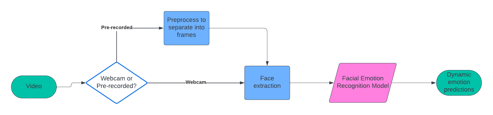

### FER Model Selection Criteria
We decided to use existing packages for face extraction and focus on finding and optimizing an FER model, which must satisfy two criteria: fast frame-by-frame inference time and high prediction accuracy. The inference time must be fast to ensure a smooth real-time prediction and minimize lags, which lead us to consider light-weight neural network models as our primary target. We chose light-weight models because they have significantly less parameters to fit, thus offering a balance between computational efficiency and accuracy at test time.

### Temporal Smoothing
Temporal smoothing is a technique in signal and video processing to reduce the effect of drastic fluctuations in input data. The goal of this approach is to make the data more coherent or "smooth" so that underlying features can be better studied. We implement two types of temporal smoothing. The qualitative effect of applying different temporal smoothing will be discussed in the Experiments section.

- The first type is referred to as AverageSmooth, implemented with sliding window; given smoothing window $n_{frames}$ and original image value $v(t)$, the `average_smooth` and `average_smooth2`  functions will output smoothed value $f(t)$ at frame t is given by:

  $$f(t) = \frac{1}{n_{frames}}\sum_{i=0} ^{n_{frames}-1} v(t-i) $$ 

  where `average_smooth` performs temporal smoothing based on previous ${n_{frames}-1}$ frames, and `average_smooth2` performs smoothing based on the previous and next $\frac{n_{frames}}{2}$ frames.

- We supposed the current frame should be more important than previous and successing frames, so we wanted to perform unven-smooth as well. Thus, we tried to implement a `gaussian_smooth` function. We used scipy.ndimage.gaussian_filter1d to perform a 1D smooth on the detected image before normalizaing and passing them to pattlite classifier. 

- We also tried temporal smoothing based on single frame predictions using the same sliding window technique.

### Data Augmentation
In addition to applying temporal smoothing, we incorporated various forms of data augmentation to improve the robustness of the model. As shown in the table below, we applied augmentation in brightness, rotation, width and height shifts, shear, as well as zoom. These slight modifcations made to the original inputs enable the model to learn the underlying features from video frames with varying lighting conditions, angle, and blurriness. 

  **Table 1: Data Augmentation Applied to RAF-DB Images**

        |-------------------|----------------------|
        |     Variable      |  Augmentation Range  | 
        |-------------------|----------------------|
        |    Brightness     |      0.5 ~ 1.5       |           
        |-------------------|----------------------|
        |     Rotation      |          20          | 
        |-------------------|----------------------|
        |    Width Shift    |         0.2          |  
        |-------------------|----------------------|
        |    Height Shift   |         0.2          |
        |-------------------|----------------------|
        |       Shear       |         0.1          |
        |-------------------|----------------------|
        |       Zoom        |         0.2          |
        |-------------------|----------------------|

An example of comparison between unmodified vs augmented RAF-DB images is shown below. 

<table width="100%">
  <tr>
    <th width="40%" style="text-align: center">Original RAF-DB Images</th>
    <th width="40%" style="text-align: center">RAF-DB Images with Data Augmentaion</th>
  </tr>
  <tr>
    <td width="40%" style="text-align: center">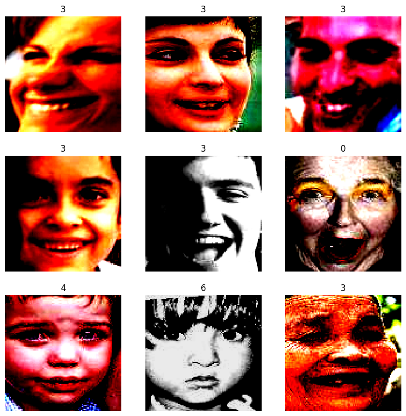</td>
    <td width="40%" style="text-align: center">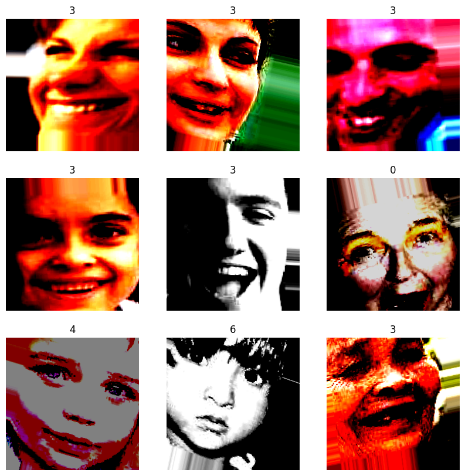</td>
  </tr>
</table>
 

<!-- **Figure 2a: Original RAF-DB Images**

**Figure 2b: RAF-DB Images with Data Augmentation**
 -->

### Improvement on Facial Detection Model
Although the Harr Cascade classifier is effective for the task of face detection, we noticed a recurring issue with it recognizing non-face objects in the background of videos, such as shown in the figure below. In order to eliminate this issue, we assessed the size of each face detected and only preserved the largest face in the event where multiple faces were falsely detected. Of course, this method would not work in the case of multiple real faces being present in the video, but we will leave this as an extension for future works. 
  

    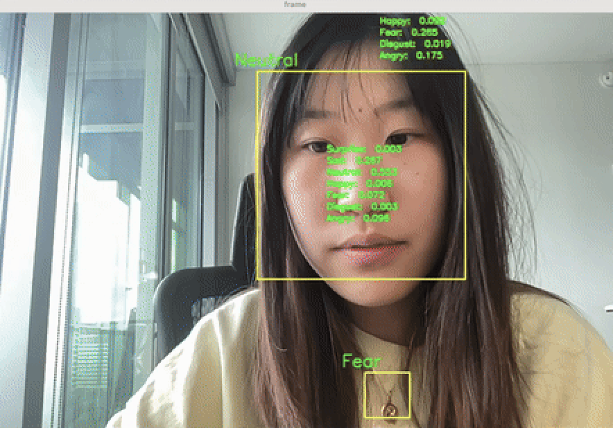
  

    
           

### Current Best Approach
Our current best approach is implementing the facial detection -> FER pipeline in **Figure 1** with OpenCV's Harr Cascade face detection model and PAtt-Lite architecture for the frame-by-frame FER task, along with performing data augmentation on the training dataset and temporal smoothing on the input frames. The Harr Cascade model detects faces using a series of simple "Harr-like" features to identify different parts of the facial landscape through a sliding window approach. It is referred to as a "casacade" model because different classifiers work in a cascade manner to identify different features of the face. As described earlier on in the Related Works section, PAtt-Lite is a model based on a truncated and pretrained MobileNetV1 backbone, a patch extraction layer, and a self-attention classification layer. 

The Harr Cascade face detection model was used directly out of box with minor modifications described above, whereas the PAtt-Lite model had to be fully retrained from scratch due to deprecation of original .h5 file and unknown data normalization and augmentation performed during training. We applied our own normalization (samplewise_std_normalization=True, samplewise_center=True) as well as custom data augmentation as described in **Table 1**. We experimented with both `average_smooth` and `gaussian_smooth`, the two had comparable effects on smoothing the prediction outcomes. 

### Intuition: why does our best approach resolve problems in previous works?
 Our best approach would provide a good starting point for research in real-time frame-level FER for several reasons. First of all, the pipeline is built upon previous models for facial detection and static FER that are proven to be high-performing and have fast inference time. Specifically, the chosen PAtt-Lite FER model is adept at predicting challenging and complex facial expressions on the RAF-DB dataset. The RAF-DB dataset itself is also a great candidate for training a static FER model for frame-by-frame video FER purposes, for it contains photos of people from diverse demographics and under various lighting conditions and angle, which is further enhanced by data augmentation. This improves the robustness of our retrained PAtt-Lite model, which is extremely helpful for addressing an important challenge when dealing with video inputs - the lighting condition, blurriness, angle, and zoom are oftentimes changing frame-by-frame. On top of this, temporal smoothing helps alleviate these abrupt frame-by-frame changes in environment that may play a role in incorrect predictions of facial emotion. 

## Experiments: Part I

In the first half of the semester, we studied and compared the efficiency and accuracy of three lightweight models in order to get an initial idea of the expected inference times and prediction accuracies of different models, as well as compare them with each other. Note that all experiments were performed on the RAF-DB dataset, with over 15,000 RGB images with size of 224x224 across 7 emotion classes. 

### Baseline: Fine-tuned MobileNet

To establish a baseline model, we fine-tuned a MobileNet model using the RAF-DB dataset. We chose this particular dataset because it contains images from various lighting conditions, angles, as well as covering diverse demographic groups. It is also readily available online with manageable size; we had attempted to use AffectNet for it consists of a much larger number of images, but the training time would be too long and we had failed to access the dataset in the end. The data (organized into 64-image batches) were separated into 60% training, 20% validation, and 20% testing. The model was fine-tuned by unfreezing only the classification layer and training for 20 epochs, as shown below. The test accuracy was 66.07%.

<table width="100%">
  <tr>
    <th width="40%" style="text-align: center">Fine-Tuned MobileNet Accuracy</th>
    <th width="40%" style="text-align: center">Fine-Tuned MobileNet Loss</th>
  </tr>
  <tr>
    <td width="40%" style="text-align: center">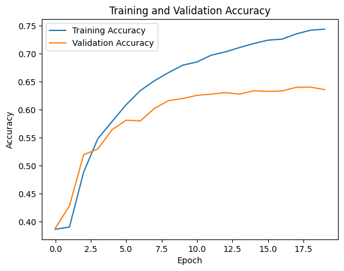</td>
    <td width="40%" style="text-align: center">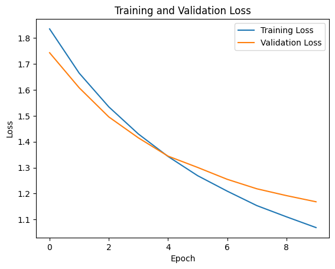</td>
  </tr>
</table>
 
 
<!-- 

    -->

### PAtt-Lite
As mentioned previously, PAtt-Lite is a light-weight network that uses a truncated MobileNet and attention mechanisms. Although the PAtt-lite paper quotes a 95.05% test accuracy on the RAF-DB dataset, we were unable to produce this accuracy directly using the pretrained model from the provided GitHub repository and only got a test accuracy around 20%. We believe this discrepancy is caused by the unknown normalization and data preprocessing being used in the PAtt-lite paper, which is not disclosed in the GitHub repository. Thus, we decided to fully retrain this model and see if the high test accuracy can be reproduced. 
This was accomplished by unfreezing all parameters and training on the RAF-DB dataset for 20 epochs with a learning rate scheduler that adjusts learning rate automatically on validation accuracy plateau. To cross-compare the vanilla MobileNet model, we adopted the same setting and organized the data into 64-image batches and separated it into 60% training, 20% validation, and 20% testing. After retraining the full PAtt-lite model, we were able to reproduce a high test accuracy of 96.58%. Below shows the training and validation accuracies and losses throughout the 20 epochs of training. 

<table width="100%">
  <tr>
    <th width="40%" style="text-align: center">Pattlite Accuracy</th>
    <th width="40%" style="text-align: center">Pattlite Loss</th>
  </tr>
  <tr>
    <td width="40%" style="text-align: center">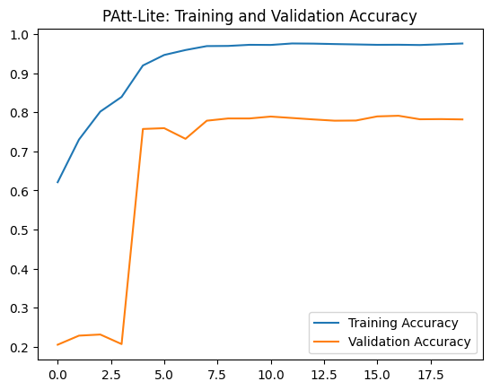</td>
    <td width="40%" style="text-align: center">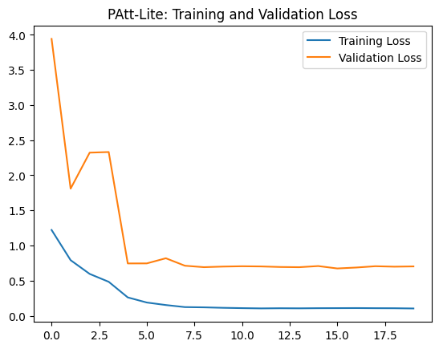</td>
  </tr>
</table>
 

<!-- 
   

    -->

### DDAMFN
This model is proposed in "[A Dual-Direction Attention Mixed Feature Network for Facial Expression Recognition](https://www.mdpi.com/2079-9292/12/17/3595)". The network has two components: the Mixed Feature Network (MFN) serving as the backbone, and the Dual-Direction Attention Network (DDAN) as the head. The authors provide a pretrained MFN network and the file for training the attention network on different datasets. The network introduces varying kernel sizes, and noises in training process to improve robustness.

The following result is based on the modified training file on raf-db dataset. The model was trained on A100 GPU, with 4 workers, batch size 256, epoch 20, and attention head 1. The model was trained and tested based on the modified training/testing scripts provided by the authors, the retrained model and scripts can be found [here](https://drive.google.com/drive/folders/1d0LOh5GycGGPqf_Cp5JU_tYrXU1_y6pW). The retrained model has the test accuracy of 90.00%. We also tested the retrained model on some custom images(the lighting conditions seemed pretty bad after transformation actually...), the model gave an "okay" performance(4/7 accuracy).The custom test of the re-trained model can be viewed [here](https://colab.research.google.com/drive/14RJw1N22kBJEXraPQYl7Y-ugiCATBKgG). (Note: our first attempts to retrain this model don't use Dual-Direction Attention as the paper suggests due to the uncertainty of the required computing resources, we'll update the model and its performance later).

<table width="100%">
  <tr>
    <th width="40%" style="text-align: center">DDAMFN Accuracy</th>
    <th width="40%" style="text-align: center">DDAMFN Loss</th>
  </tr>
  <tr>
    <td width="40%" style="text-align: center">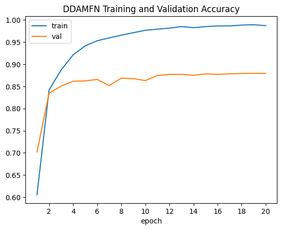</td>
    <td width="40%" style="text-align: center">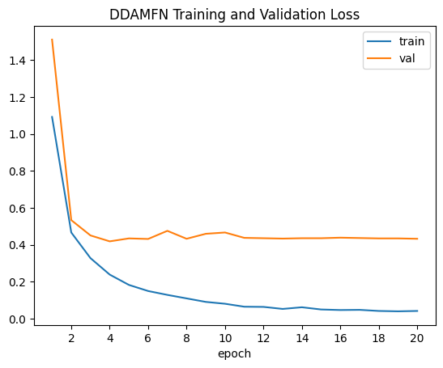</td>
  </tr>
</table>
 

<!-- 

 -->

### Model Comparison
<!--  - number of parameters, test accuracy (on RAFDB), inference time
    - DDAMFN: 
        - Learnable parameters: 4126445
        - Test accuracy: 0.900
        - Inference time: 0.1967 -->
  
      |       Model       | Number of Parameters | Average Inference Time (per frame) | Test Accuracy (RAF-DB) |
      |-------------------|----------------------|------------------------------------|------------------------|
      |Finetuned MobileNet|       4,253,864      |              44ms                  |          66.07%        |
      |-------------------|----------------------|------------------------------------|------------------------|
      |     PAtt-Lite     |       1,102,664      |              46ms                  |          96.58%        |
      |-------------------|----------------------|------------------------------------|------------------------|
      |       DDAMFN      |       4,126,445      |             196.7ms                |          90.00%        |
      |-------------------|----------------------|------------------------------------|------------------------|
      
As shown in the table above, we cross-compared several factors of the three lightweight models: number of parameters (how light-weight it is), average time for it to predict the label of a frame, as well as test accuracy on RAF-DB. Out of the three models, PAtt-Lite is the most light-weight and produced the highest test accuracy on RAF-DB, and it also has a low inference time that is comparable to the Finetuned MobileNet. Thus, we will be focusing on using and optimizing PAtt-Lite for the next step since it seems to be the most promising model for real-time FER inference.
      

### Experiments of Real-time facial emotion recognition 
In addition to evaluating the cutting-edge face expression detection models, we delve into the realm of real-time facial emotion recognition. The base model of of the real-time tracking is built upon CNN architectures, with the training and testing datasets sourced  from the  [Kaggle](https://www.kaggle.com/datasets/jonathanoheix/face-expression-recognition-dataset "DATASET").  The model achieved 72% training accuracy and 60% validation accuracy. Despite the model's suboptimal efficiency, its performance highlights a remarkable capacity for generalization to unseen data. Regarding the facial recognition process, the project employs the Haar Cascade Classifier, loaded from the [`haarcascade_frontalface_default.xml`](haarcascade_frontalface_default.xml) file, to detect faces in the video frames. The [demo code](https://github.gatech.edu/xma335/CS6476_project/blob/main/notebooks/real_time_pipeline.ipynb) continuously captures video frames from the camera source, facilitating real-time processing. It subsequently employs the emotion detection model to classify faces and overlay the corresponding emotion label onto the video frame. The detection of real-time facial expression is shown below.

.

<!--
### What's next?

Our next objective is to integrate the aforementioned models into the video detection pipeline, where we'll assess both the inference time and accuracy of facial dynamic expressions. So far, we have already written a script to preprocess pre-recorded videos by splitting them into individual frames. We'll also try temporal smoothing and see if it will improve the model's performance.

However, the accuracy of the facial detection model seems to not perform so well with real-time webcam video streams/pre-recorded videos, so we also hope to explore alternative models for this purpose. 

Additionally, we plan on investigating and exploring implementation of a more advanced face recognition framework, such as [deep face](https://github.com/serengil/deepface), if time permits. This enhanced face recognition approach could potentially offer improved performance and accuracy in identifying faces within the video stream.
-->

## Experiments: Part II - After Project Update

### Experienment Set Up

- Purposes

  - Step 1: Test the performance of previously retrained-pattlite model with real video captured data and see if we need further modification of the model. We decided to continue with the pattlite model based on the previous experimentes using RAF-DB dataset, considering accuracy and inference time; before we do smoothing, we want to test the model beyond the given dataset.
 
  - Step 2: Implement data augmentation on RAF-DB and examine its effect on PAtt-Lite's performance and robustness, both quantitatively (through comparing test accuracy) and qualitatively using custom video data. 

  - Step 3: Implement different types of temporal smoothing, including blending images and smoothing the prediction scores to improve the FER prediction perfomance of the chosen model - Pattlite. Since we don't have video data, and our framework is based on single image predictions, we'll do temporal smoothing by combining consecutive frames. We think either smoothing the image data or the prediction scores might give a better result. 

    By smoothing the image input, we wanted to remove the outlier values that may affect the prediction and also wanted to take transition into consideration. By smoothing the prediction scores, we may also eliminate the single biased prediction, but the results are not probabilities anymore.

- Input Description:

  - Since we don't have video data, we tried to record some videos and used them to test the performance of our model. The following image is an example of one of the frames in our demo video, and by visual assessment, it should be an expression of surprise.

  - The frames are captured using `cv2.VideoCapture`, 30 FPS, step size 1, resized to 224x224 to feed into the PAtt-Lite model; the demo video has 350 frames in total.

- Desired Output:

  We decided to focus on video inputs instead of webcam. And our output will be individual labeled frames(with both predicted label and the scores for each category) from the input videos, and outstream the frames to a new video.

  

    Single Frame Ouput
     
    
  

- Metrics:

  - For examining success of data augmentation, we used test accuracy of PAtt-Lite trained with data augmentation to compare with PAtt-Lite without data augmentation for quantitative comparison of how the augmentation affects prediction accuracy. 
  - For temporal smoothing, it is difficult to devise a quantitative metric since we don't have video data with frame-by-frame labels. Thus, the effect of adding temporal smoothing is evaluated by the group members' subjective visual understanding and by manually examining the frame-by-frame prediction scores for each label. We hope our method will produce a more stable and accurate prediction and we'll also do cross-method comparisons. A possible future direction that would enhance our current work is to establish a database for evaluating dynamic video FER. 

### Results:
- In the context of real-time sentiment analysis, where the absence of ground truth for video-based dynamic sentiment comparison poses a challenge, two baselines was developed which serve to compare the performance of different pretrained image sentiment analysis models and smoothing techniques. The aim is to enhance the accuracy and reliability of sentiment analysis in real-time scenarios.
- Baseline 1:  For evaluating how data augmentation affects the model performance, we choose the baseline to be the prediction of the non-augmented pattlite model. 
    - With data augmentation, we expect the predictions to be more robust and less sensitive to external factors such as lighting, angle, rotation, and size of the face in the frame.
- Baseline 2:  For evaluating how temporal smoothing affects the model performance, we choose the baseline to be the prediction of the augmented pattlite model without smoothing.

  - We will also compare the results between different smoothing methods using the augmented-pattlite model; we'll also discuss about the performance of the non-augmented pattlite model and augmented pattlite model.

  - With smoothing, the prediction should be more accurate or stable, and shouldn't take much longer time to process and predict each frame.

#### Key Results Presentations:

- **Augmented-Pattlite v.s. Pattlite**

  We first tested with the retrained-pattlite model on the custom video input and we found that the model lacked robustness for some video captured face detection. We need to apply additional augmentation to make the predictions more reliable(as shown below). So we decided to add additional transformation to the data and then retrained the model. The augmented-pattlite is more robust on customized video captured data.

  **Performance Discussion:** 
  
  Let's first quantitatively compare the performance of pattlite with and without augmentation. Below shows the accuracy and loss curves for training the pattlite model with data augmentation. The training accuracy converges slower than the non-augmented data, which is an expected effect from data augmentation. The final test accuracy of data augmented pattlite is **91%**, which suggests that it has comparable accuracy to model trained on non-augmented data. 
  
  <table width="100%" >
    <tr>
      <th width="40%" style = "text-align: center">Training and Validation Accuracy (Augmented)</th>
      <th width="40%" style = "text-align: center">Training and Validation Loss (Augmented)</th>
    </tr>

    <tr>
      <td width="40%">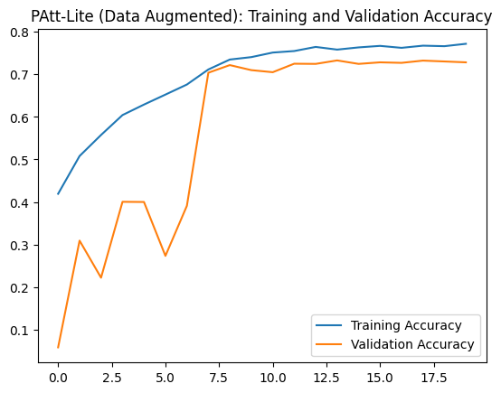</td>
      <td width="40%">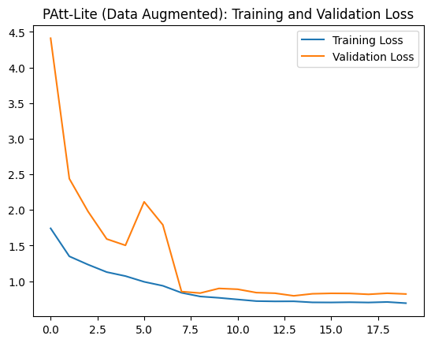</td>
    </tr>

  </table>
  
  Next, we examine the performance of augmented pattlite vs non-augmented pattlite qualitatively using sample videos. As shown in the table below, the input frame looks like a "Suprised" face. One the left, the augmented pattlite model can successfully predict "Surprise" however, on the right, the non-augmented pattlite model predict "Sad".

  <table width="100%" >
    <caption style = "text-align: center">
      Augmented-Pattlite v.s. Pattlite
    </caption>
    <tr>
      <th width="40%" style = "text-align: center">Augmented</th>
      <th width="40%" style = "text-align: center">Original</th>
    </tr>

    <tr>
      <td width="40%"></td>
      <td width="40%"></td>
    </tr>

  </table>
- **Temporal Smoothing**

  In general, `average_smooth`, `gaussian_smooth` and `no_smooth` all give good-enough predictions. However, there are some cases where single-frame prediction can be off, and both `average_smooth` and  `gaussian_smooth` can filter it out, and make the predictions of consecutive frames consistent. 

  Meanwhile,  `average_smooth` and `gaussian_smooth` would give more distinguishable scores for the predicted label, or give smoother scores when in fact the expressions are about to transit. We did not have enough time to find the best values for the hyperparameters, for example, radius, sigma for gaussian smooth and the nframes sliding window for average smooth; the following images are outputs using `average_smooth` with sliding window of 5 frames and `gaussian_smooth` with radius of 2 and sigma of 3.

  **Performance Discussion:**

  - In the first table, we can see that by applying temporal smoothing, we can remove some of the inconsistency between single frame prediction. This frame is extracted among a series of neutral frames, as we can see, without smoothing(left 1), the model could make a different prediction on a single frame, while with smoothing, the between-frames consistency is added. 

   

  <table style="width: 100%">
    <caption style = "text-align: center">
      Temporal smooth filters out inconsistent single frame prediction
    </caption>
    <tr>
      <th width="40%" style = "text-align: center">no_smooth</th>
      <th width="40%" style = "text-align: center">average_smooth</th>
    </tr>

    <tr>
      <td width="40%"></td>
      <td width="40%"></td>
    </tr>
  </table>

  <table style="width: 100%">
    <tr>
      <th width="40%" style = "text-align: center">gaussian_smooth</th>
      <th width="40%" style = "text-align: center">prediction_smooth</th>
    </tr>

    <tr>
      <td width="40%"></td>
      <td width="40%">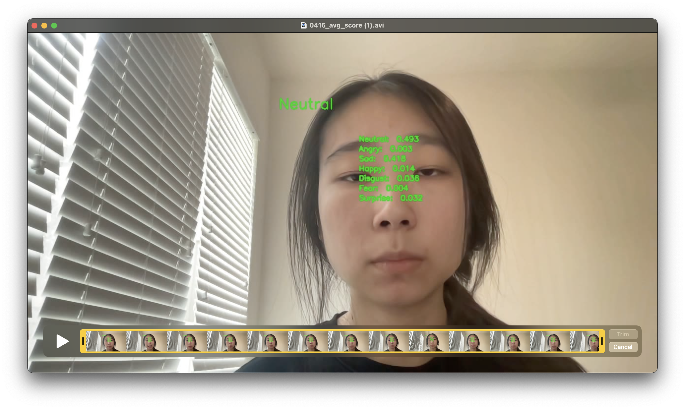</td>
    </tr>
  </table>

   

  - In the second table, we hoped to see that by smoothing, when the expressions is not changed, the model would have more confidence in the predicted label(i.e. more difference among scores); when the expression is about to change, the model could predict smoother scores, indicating the changing tendency. We supposed that `gaussian_smooth` might do a better job in this task, but we didn't have time to go deeper to tweak the hyperparameters, try different functions and test our hypothesis.
  
   

  <table width="100%">
    <caption style = "text-align: center">
      Temporal(gaussian) smooth gives smoother scores when in transition (neutral to sad)
    </caption>
    <tr>
      <th width="33%" style = "text-align: center">no_smooth</th>
      <th width="33%" style = "text-align: center">average_smooth</th>
      <th width="33%" style = "text-align: center">gaussian_smooth</th>
    </tr>

    <tr>
      <td width="33%"></td>
      <td width="33%"></td>
      <td width="33%"></td>
    </tr>
    <tr>
      <td width="33%"></td>
      <td width="33%"></td>
      <td width="33%"></td>
    </tr>
  </table>

- **Result Demos:**
  

    Gaussian Smoothing Demo(10 FPS)
     
    
  

## Discussion

In the first part of this project, we compared different models in terms of test accuracy and inference time. We found that the original retrained pattlite model lacks robustness for unseen data which are not visually processed the same as the RAF-DB data. The DDAMFN model includes data augmentation in their training process, and thus it is more robust. However, the model is more complex compared to pattlite, resulting in a much greater inference time.

We then added additional data augmentation in training process and retrained an augmented pattlite model. The augmented model can correctly predict the video captured data most of the time, however there are still wrong predictions(shown below), which could be improved probalbly by changing the architecture/hyperparameters of the model. Some more model comparisons can be made.

<table style="width: 100%">
  <caption style = "text-align: center">
    Debatable Predictions
  </caption>
  <tr>
    <th width="40%" style = "text-align: center">Neutral or Sad?</th>
    <th width="40%" style = "text-align: center">Neutral or Angry?</th>
  </tr>

  <tr>
    <td width="40%">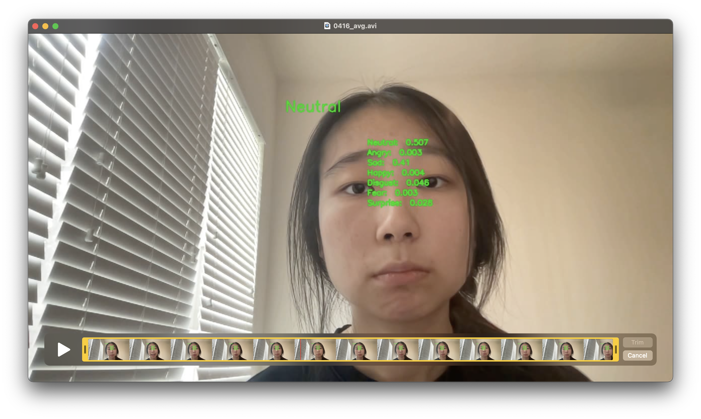</td>
    <td width="40%"></td>
  </tr>
</table>

We then tried some simple temporal smoothing approaches. Our baseline for temporal smoothing was average smooth, and we also wrote a function for uneven smoothing using 1D gaussian filter. It turned out that, smoothing would give a more stable result. However, we didn't have much time to try and get the best hyperparameters; and there are more complex smart smoothing approches that would give better results, for example, now we are doing raw-image smoothing, maybe smoothing the features work better. Also, since videos are dynamic, the transition of emotion should be captured and handled during classification. 

## Challenge Encountered
- Lack of video database with frame-by-frame facial emotion labels.
- Lack of computational resources, some model and dataset too big to be implemented and used, such as AffectNet. 
- Models need to be retrained (e.g., PAtt-Lite) in order to achieve the robust performance reported in the research paper, data preprocessing and normalization are required for this process. 
- There are many ways of implementing temporal smoothing, and we may need more time to experiment with different hyperparameters and smoothing methods to find one that works best.

## Things we would change
Overall, the biggest challenge we encountered was not being able to quantitatively evaluate the performance of the entire pipeline due to the absence of a dataset with frame-level labels. If we had more time or were to start the project again, we would like to ration some time for manually producing a custom dataset to at least have some preliminary quantitative metric of performance. 

## Team member contributions
- Xinran Gong: Fine-tuning of MobileNet model, retraining and optimizing performance of PAtt-Lite model, development of frame-by-frame video preprocessing scripts, implementing data augmentation and retraining of PAtt-Lite after augmentation.
- Shiqin Zeng: Developed real-time face tracking and preprocessing framework. Development of the postprocessing of the detected frames.
- Xiaowen Ma: Retrained and tested DDAMFN model. Implemented `average_smooth` and `gaussian_smooth`.
- Zhiyu Wan: 

## References

Here is the IEEE format reference for the provided papers:

[1] J. L. Ngwe, K. M. Lim, C. P. Lee, and T. S. Ong, "PAtt-Lite: Lightweight Patch and Attention MobileNet for Challenging Facial Expression Recognition," *arXiv preprint arXiv:2306.09626*, 2023.

[2] S. Zhang, Y. Zhang, Y. Zhang, Y. Wang, and Z. Song, "A Dual-Direction Attention Mixed Feature Network for Facial Expression Recognition," *Electronics*, vol. 12, no. 17, p. 3595, 2023.

[3] A. G. Howard et al., "Mobilenets: Efficient convolutional neural networks for mobile vision applications," *arXiv preprint arXiv:1704.04861*, 2017.

[4] D. Canedo and A. J. Neves, "Facial expression recognition using computer vision: A systematic review," *Applied Sciences*, vol. 9, no. 21, p. 4678, 2019.

[5] K. Wang, X. Peng, J. Yang, S. Lu, and Y. Qiao, "Suppressing uncertainties for large-scale facial expression recognition," in *Proceedings of the IEEE/CVF conference on computer vision and pattern recognition*, 2020, pp. 6897-6906.

[6] J. Zeng, S. Shan, and X. Chen, "Facial expression recognition with inconsistently annotated datasets," in *Proceedings of the European conference on computer vision (ECCV)*, 2018, pp. 222-237.

[7] T. Debnath et al., "Four-layer ConvNet to facial emotion recognition with minimal epochs and the significance of data diversity," *Scientific Reports*, vol. 12, no. 1, p. 6991, 2022.

[8] Y. Fan, X. Lu, D. Li, and Y. Liu, "Video-based emotion recognition using CNN-RNN and C3D hybrid networks," in *Proceedings of the 18th ACM international conference on multimodal interaction*, 2016, pp. 445-450.

[9] Y. Chen, J. Wang, S. Chen, Z. Shi, and J. Cai, "Facial motion prior networks for facial expression recognition," 2019.

[10] E. Ryumina, D. Dresvyanskiy, and A. Karpov, "In search of a robust facial expressions recognition model: A large-scale visual cross-corpus study," *Neurocomputing*, vol. 514, pp. 435-450, 2022.
